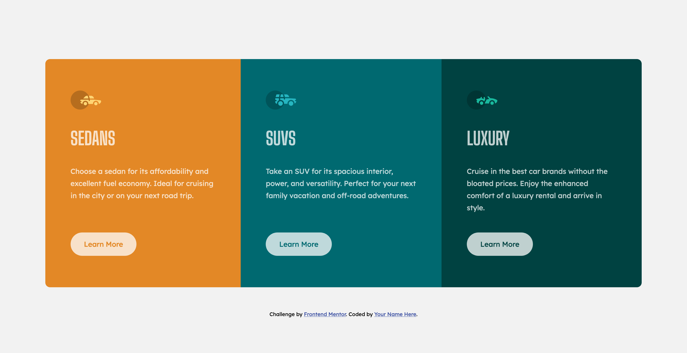

### The challenge

Users should be able to:

- View the optimal layout depending on their device's screen size
- See hover states for interactive elements

### Screenshot

### Links

- Solution URL: [Add solution URL here](https://github.com/jocovass/frontend-mentor-3-column-card)
- Live Site URL: [Add live site URL here](https://infallible-kepler-bd041c.netlify.app)